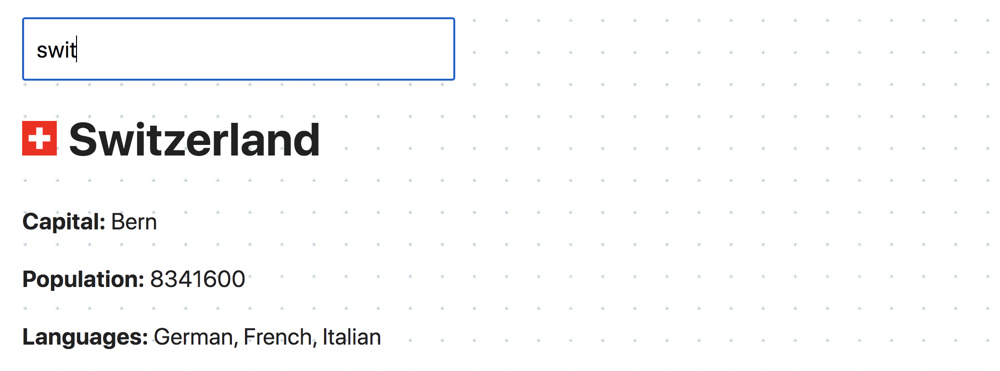

**Read in other languages: [Русский](README.md), [Українська](README.ua.md),
[English](README.en.md), [Español](README.es.md), [Polski](README.pl.md).**

# Критерии приема

- Создан репозиторий `goit-js-hw-10`.
- При сдаче домашней работы есть две ссылки: на исходные файлы и рабочую
  страницу на `GitHub Pages`.
- При посещении живой страницы задания, в консоли нету ошибок и предупреждений.
- Проект собран с помощью
  [**parcel-project-template**](https://github.com/goitacademy/parcel-project-template).
- Код отформатирован `Prettier`.

## Стартовые файлы

В [**папке src**](./src) ты найдешь стартовые файлы. Скопируй их себе в проект,
полностью заменив папку `src` в
[**parcel-project-template**](https://github.com/goitacademy/parcel-project-template).
Для этого скачай весь этот репозиторий как архив или используй
[**сервис DownGit**](https://downgit.github.io/) для скачивания отдельной папки
из репозитория.

## Задание - поиск стран

Создай фронтенд часть приложения поиска данных о стране по её частичному или
полному имени. Используй публичный API
[**Rest Countries**](https://restcountries.eu/), а именно
[**ресурс name**](https://restcountries.eu/#api-endpoints-name), возвращающий
массив объектов стран удовлетворивших критерий поиска. Добавь минимальное
оформление элементов интерфейса.

### HTTP-запрос

Напиши функцию `fetchCountries(name)` которая делает HTTP-запрос на
[**ресурс name**](https://restcountries.eu/#api-endpoints-name) и возвращает
промис с массивом стран - результатом запроса. Вынеси её в отдельный файл
`fetchCountries.js` и сделай именованный экспорт.

### Фильтрация полей

В ответе от бэкенда возвращаются объекты, большая часть свойств которых тебе не
пригодится. Чтобы сократить объем передаваемых данных добавь строку параметров
запроса - так этот бэкенд реализует фильтрацию полей. Ознакомься с
[**документацией синтаксиса фильтров**](https://restcountries.eu/#filter-response).

Тебе нужны только следующие свойства:

- `name` - полное имя страны
- `capital` - столица
- `population` - население
- `flag` - ссылка на изображение флага
- `languages` - массив языков

### Поле поиска

Название страны для поиска пользователь вводит в текстовое поле
`input#search-box`. HTTP-запросы выполняются при наборе имени страны, то есть по
событию `input`. Но, делать запрос при каждом нажатии клавиши нельзя, так как
одновременно получится много запросов и они будут выполняться в непредсказуемом
порядке.

Необходимо применить приём `Debounce` на обработчике события и делать
HTTP-запрос спустя `300мс` после того, как пользователь перестал вводить текст.
Используй пакет
[**lodash.debounce**](https://www.npmjs.com/package/lodash.debounce).

Если пользователь полностью очищает поле поиска, то HTTP-запрос не выполняется,
а разметка списка стран или информации о стране пропадает.

Выполни санитизацию введенной строки методом `trim()`, это решит проблему когда
в поле ввода только пробелы или они есть в начале и в конце строки.

### Интерфейс

Если в ответе бэкенд вернул больше чем 10 стран, в интерфейсе пояляется
уведомление о том, что имя должно быть более специфичным. Для уведомлений
используй [**библиотеку notiflix**](https://www.notiflix.com/) и выводи такую
строку `"Too many matches found. Please enter a more specific name."`.

Если бэкенд вернул от 2-х до 10-х стран, под тестовым полем отображается список
найденных стран. Каждый элемент списка состоит из флага и имени страны.

Если результат запроса это массив с одной страной, в интерфейсе отображается
разметка карточки с данными о стране: флаг, название, столица, население и
языки.

> ⚠️ Достаточно чтобы приложение работало для большинства стран. Некоторые
> страны, такие как `Sudan`, могут создавать проблемы, поскольку название страны
> является частью названия другой страны, `South Sudan`. Не нужно беспокоиться
> об этих исключениях.

### Обработка ошибки

Если пользователь ввёл имя страны которой не существует, бэкенд вернёт не пустой
массив, а ошибку со статус кодом `404` - не найдено. Если это не обработать, то
пользователь никогда не узнает о том, что поиск не дал результатов. Добавь
уведомление `"Oops, there is no country with that name"` в случае ошибки
используя [**библиотеку notiflix**](https://www.notiflix.com/).

> ⚠️ Не забывай о том, что `fetch` не считает 404 ошибкой, поэтому необходимо
> явно отклонить промис чтобы можно было словить и обработать ошибку.
